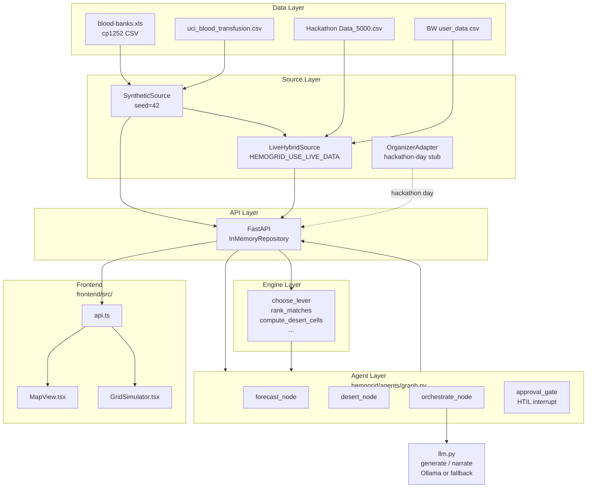

# 02 — Architecture

## Layered Architecture

```
┌──────────────────────────────────────────────────────────────────────────────┐
│  Raw Data Layer                                                              │
│  data/blood-banks.xls (cp1252 CSV)  data/uci_blood_transfusion.csv          │
│  newdata/Hackathon Data_5000.csv    newdata/BW_Sample_Data_Updated_v3...csv  │
└─────────────────────────────┬────────────────────────────────────────────────┘
                              │ DataSource.load() → CanonicalDataset
┌─────────────────────────────▼────────────────────────────────────────────────┐
│  Source / Adapter Layer                                                      │
│  SyntheticSource (default dev)    LiveHybridSource (HEMOGRID_USE_LIVE_DATA)  │
│  OrganizerAdapter (hackathon-day stub, NotImplementedError)                  │
└─────────────────────────────┬────────────────────────────────────────────────┘
                              │ CanonicalDataset (patients, donors, banks,
                              │                  clinics, requests)
┌─────────────────────────────▼────────────────────────────────────────────────┐
│  Engine Layer  (hemogrid/engine.py)                                          │
│  Pure functions: abo_rh_compatible, phenotype_antibody_safe,                 │
│  donor_eligible, haversine_km, forecast_due, rank_matches,                   │
│  blood_desert_score, collect_inventory_candidates,                           │
│  certified_inventory_candidates, choose_lever, compute_desert_cells          │
└──────────────────┬──────────────────────────────────────────────────────────┘
                   │ deterministic results (dict / list of tuples)
        ┌──────────▼──────────────────────┐
        │ Agent / Orchestration Layer     │
        │ hemogrid/agents/graph.py        │
        │ LangGraph StateGraph            │
        │ forecast → desert →             │
        │ orchestrate → approval_gate →   │
        │ [redistribution | donor_matching│
        │  | emergency | declined]        │
        │                                 │
        │ LLM narration via llm.py        │
        │ (ollama qwen2.5:7b or fallback) │
        └──────────┬──────────────────────┘
                   │ GraphState results
┌──────────────────▼──────────────────────────────────────────────────────────┐
│  API Layer  (hemogrid/api/main.py)                                          │
│  FastAPI + InMemoryRepository[T]                                             │
│  GET /api/health  GET /api/banks  GET /api/deserts                          │
│  GET /api/patients  GET /api/patients/{id}/match                            │
│  GET /api/patients/{id}/activity                                             │
│  POST /api/patients/{id}/propose   POST /api/patients/{id}/approve          │
│  GET/POST /api/demo/*                                                        │
│  CORS: localhost:5173                                                        │
└──────────────────┬──────────────────────────────────────────────────────────┘
                   │ JSON over HTTP
┌──────────────────▼──────────────────────────────────────────────────────────┐
│  Frontend Layer  (frontend/src/)                                            │
│  React 19 + Vite 8 + react-leaflet                                          │
│  App.tsx → MapView.tsx (3-column layout)                                    │
│  GridSimulator.tsx (slide-up simulation widget)                              │
│  api.ts (typed fetch client)                                                 │
└─────────────────────────────────────────────────────────────────────────────┘
```

## Mermaid Diagram



## Load-Bearing Design Principles (as actually implemented)

### 1. Deterministic Core / LLM-Only-at-Edges
`engine.py` contains zero LLM calls and zero randomness. It imports only standard Python and `hemogrid.models`. Every ABO compatibility decision, antibody safety check, distance calculation, donor ranking, and lever selection is in pure Python with no external side effects.

`llm.py` is the single LLM call site (`generate()`). It is called only from three places: `narrate_decision()` in `orchestrate_node`, `draft_donor_message()` in `orchestrate_node`, and `generate_emergency_escalation()` in `orchestrate_node`. All three functions catch `LLMUnavailable` and return deterministic template strings, so the system runs fully without Ollama.

### 2. Canonical Schema + DataSource Adapter Pattern
The `DataSource` ABC (`hemogrid/sources/base.py`) has a single method: `load() → CanonicalDataset`. Every source — synthetic, live, or future organizer adapter — returns the same `CanonicalDataset` shape. The API layer stores entities in `InMemoryRepository[T]` instances (one per canonical type) and accesses `app.state.dataset` for engine batch calls. No source is called after startup.

### 3. Per-Field Provenance
Every canonical entity inherits `provenance: dict[str, Provenance]` from `CanonicalModel`. The loader sets this field-by-field at construction time. Values: `PROVIDED` (came from a source column), `DERIVED` (computed from source data), `SYNTHETIC` (fabricated). The UI is designed to render per-field tooltips using this dict.

### 4. Privacy/Ethics
- All IDs are tokenized: `PAT-NNNN`, `DON-NNNN`, `BB-NNNN`, `CLN-XXX-01`. No real patient, donor, or bank identity enters the system.
- `OrganizerAdapter` must set `consent.contactable` explicitly; the engine's `donor_eligible()` checks it before any donor can be contacted.
- No action (dispatch, activation, escalation) can occur without a human coordinator approval click (HITL gate).

### 5. Cloud-Swap Readiness
`storage.py` defines `Repository[T]` as an ABC. `InMemoryRepository` is the only implementation. A comment in `storage.py` documents S3, GCS, DynamoDB, and Postgres as day-of cloud-swap targets. `lifespan` in `main.py` builds one repo per entity type; endpoints read from repos, not from the source directly.

`llm.py`'s `generate()` reads `HEMOGRID_LLM_PROVIDER` at call time (not import time), enabling provider swap without restart.

### 6. Build Discipline
Every frontend iteration is gated by `npx tsc --noEmit` (from `CLAUDE.md`). The `tsconfig.app.json` enables `strict`, `noUnusedLocals`, `noUnusedParameters`.

## The Hybrid Agency Model

The LangGraph graph has **8 nodes** total. They divide into:

| Node | Type | What it does |
|------|------|-------------|
| `forecast_node` | Deterministic engine wrapper | Calls `engine.forecast_due()`, builds `Request` object |
| `desert_node` | Deterministic engine wrapper | Calls `engine.compute_desert_cells()`, extracts patient's clinic cell |
| `orchestrate_node` | Deterministic + LLM narration | Calls `engine.choose_lever()`, calls `_agent_select()` (bounded LLM prompt), calls `narrate_decision()` / `draft_donor_message()` / `generate_emergency_escalation()` |
| `approval_gate_node` | HITL | Calls `interrupt(proposal)` — graph suspends; resumes on `Command(resume=)` |
| `redistribution_node` | Deterministic engine wrapper | Calls `collect_inventory_candidates()`, sets `status="fulfilled"` |
| `donor_matching_node` | Deterministic engine wrapper | Calls `rank_matches()`, sets `status="fulfilled"` |
| `emergency_node` | Pass-through | Sets `status="fulfilled"`, carries `emergency_reasoning` into trace |
| `declined_node` | Pass-through | Sets `status="declined"` when coordinator rejects |

There is **no genuine ReAct agent** in the code. `_agent_select()` is a bounded manual loop: it builds a single structured prompt from the engine-certified candidate set, calls `generate()`, parses the JSON response, validates the selected `bank_id` against the certified set, and falls back to the engine result on any failure (empty response, parse error, invalid selection, `LLMUnavailable`). The comment in `graph.py` explicitly states that `create_react_agent` is available in principle but `langchain-ollama` is not installed, hence the manual loop.

The "agent" label in the trace events (e.g., `"agent": "Supply Strategy Orchestrator"`) is a human-readable description displayed in the UI, not a framework construct.

## The Two-Lock Safety Model

### Lock 1 — Engine-Certified Option Set (Guardrail)
Location: `engine.py:certified_inventory_candidates()` (lines 559–596) and `_agent_select()` in `graph.py` (lines 117–203).

Before the LLM agent is consulted, `certified_inventory_candidates()` runs the full filter pipeline (ABO+Rh, antibody safety, not-expired, within radius, supply_clock ≤ need_clock) and returns only the IDs that are provably safe AND deliverable. The LLM receives ONLY these IDs and cannot see or select anything outside this set. If it attempts to, `_agent_select()` checks `sel_id in valid_ids` and rejects the selection, falling back to the engine's `choose_lever()` result.

This lock is always active, regardless of whether Ollama is online.

### Lock 2 — Human-in-the-Loop (HITL) Interrupt
Location: `graph.py:approval_gate_node()` (lines 443–517), specifically `decision = interrupt(proposal)` at line 494.

When `require_approval=True` (the `/propose` path), the graph calls `interrupt(proposal)` which suspends execution and hands the proposal payload back to the API caller via LangGraph's checkpoint mechanism. The graph state is stored in `InMemorySaver`. The API returns `thread_id` + proposal to the frontend, which displays an approve/reject UI. Only after the coordinator clicks approve/reject does `approve_request()` call `graph.invoke(Command(resume={"decision": decision}), ...)`, resuming execution.

No state mutation (bank adjustment, patient status) occurs until the `/approve` endpoint receives a decision and completes.

The `/activity` path uses `require_approval=False`, making `approval_gate_node` a pass-through (returns `{}`) — this path is for read-only pipeline visualization without committing any action.
