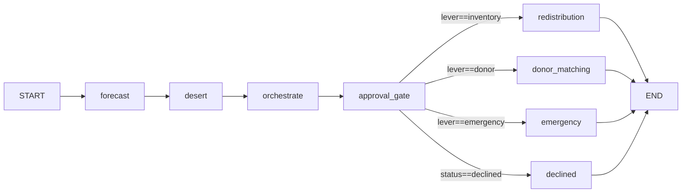

# 06 — Agents and LLM

## LangGraph Graph

### `GraphState` (TypedDict, `hemogrid/agents/graph.py`)

| Field | Type | Set by |
|-------|------|--------|
| `patient_id` | `str` | Caller (input) |
| `dataset` | `CanonicalDataset` | Caller (input) |
| `today` | `date` | Caller (input) |
| `require_approval` | `bool` | Caller (input); `False` = /activity pass-through, `True` = /propose HITL |
| `request` | `Optional[Request]` | `forecast_node` |
| `forecast_result` | `Optional[dict]` | `forecast_node` |
| `desert_cell` | `Optional[dict]` | `desert_node` |
| `lever_result` | `Optional[dict]` | `orchestrate_node` |
| `narration` | `Optional[str]` | `orchestrate_node` |
| `status` | `str` | Initial: `"predicted"`; mutated by `approval_gate_node`, `redistribution_node`, `donor_matching_node`, `emergency_node`, `declined_node` |
| `ranked_inventory` | `list[tuple]` | `redistribution_node` |
| `ranked_donors` | `list[dict]` | `donor_matching_node` |
| `donor_message_draft` | `Optional[str]` | `orchestrate_node` (for donor lever) |
| `emergency_reasoning` | `Optional[str]` | `orchestrate_node` (for emergency lever) |
| `trace` | `Annotated[list[ActivityEvent], operator.add]` | Each node appends one `ActivityEvent` |

### Graph Topology (Mermaid)



**Conditional router** (`_approval_router`): Returns `"declined"` if `state["status"] == "declined"`, else returns `_lever_value(state["lever_result"]["lever"])`.

### Node Descriptions

**`forecast_node`** (deterministic engine wrapper):
- Finds patient in `dataset.patients` by `patient_id`
- Calls `engine.forecast_due(patient, today)` → `(next_need_date, is_due_soon)`
- Creates `Request` object: `request_id = f"REQ-GRAPH-{patient_id}"`, `component=PRBC`, `units=patient.units_per_session`
- Emits `ActivityEvent`: `step_index=0`, `agent="Demand Forecasting"`, `node="forecast"`

**`desert_node`** (deterministic engine wrapper):
- Calls `engine.compute_desert_cells(dataset, today)` for all clinics
- Extracts the cell where `cell["cell_id"] == patient.clinic_id`
- Emits `ActivityEvent`: `step_index=1`, `agent="Blood Desert Detection"`, `node="desert"`

**`orchestrate_node`** (deterministic + LLM narration):
- Calls `engine.choose_lever(request, dataset, today)` → `lever_result`
- Determines lever string via `_lever_value(result["lever"])`
- For `inventory` lever: calls `engine.certified_inventory_candidates()` → calls `_agent_select(certified, patient_id, result)` → may refine bank selection via LLM
- Calls `llm.narrate_decision(decision)` → `narration` (LLM or template fallback)
- For `donor` lever: calls `llm.draft_donor_message(...)` → `donor_message_draft`; idempotency guard: skip if field already set
- For `emergency` lever: calls `llm.generate_emergency_escalation(...)` → `emergency_reasoning`; idempotency guard same
- Emits `ActivityEvent`: `step_index=2`, `agent="Supply Strategy Orchestrator"`, `node="orchestrate"`; includes typewriter trace strings in details

**`approval_gate_node`** (HITL):
- If `require_approval=False`: returns `{}` (pass-through, no event emitted)
- If `require_approval=True`:
  1. Builds `proposal` dict from `lever_result`
  2. Calls `interrupt(proposal)` — graph suspends here; LangGraph stores checkpoint in `InMemorySaver`
  3. On resume: `decision = interrupt(proposal)` returns the `Command(resume=...)` value
  4. If `decision.get("decision") == "approve"`: sets `status="approved"`, emits approval event
  5. Else: sets `status="declined"`, emits declined event

**`redistribution_node`** (terminal for INVENTORY branch):
- Calls `engine.collect_inventory_candidates(patient, clinic_loc, dataset, today)`
- Sets `status="fulfilled"`
- Emits `ActivityEvent`: `step_index=len(state["trace"])` (3 for non-HITL, 4 for HITL)

**`donor_matching_node`** (terminal for DONOR branch):
- Calls `engine.rank_matches(request, nearby_donors, dataset, today)`
- Sets `status="fulfilled"`
- Emits `ActivityEvent` with top donor summary

**`emergency_node`** (terminal for EMERGENCY branch):
- Sets `status="fulfilled"` (escalation is considered "fulfilled" in the sense that the system has done what it can)
- Carries `emergency_reasoning` into event details
- Emits `ActivityEvent`

**`declined_node`** (terminal for DECLINED path):
- Sets `status="declined"`
- Emits `ActivityEvent`

### `ActivityEvent` TypedDict

```python
class ActivityEvent(TypedDict):
    step_index: int          # len(state["trace"]) when the node runs
    agent: str               # human-readable label
    node: str                # graph node id
    summary: str             # one-line description
    details: dict[str, Any]  # JSON-primitive values
```

### Shared Checkpointer and Compiled Graph

```python
_saver: InMemorySaver = InMemorySaver()   # module-level singleton
_compiled_graph = None                     # lazy singleton
```

`InMemorySaver` stores checkpoint state in-memory. This means:
- **State is lost on server restart** — any pending proposals (paused at approval_gate) are gone after restart
- **No cross-process sharing** — if uvicorn runs multiple workers, each has its own `_saver`
- **No persistence** — not suitable for production with real decisions

## HITL Mechanics

### Thread ID Lifecycle

For the `/propose` path (`require_approval=True`):

1. `propose_request()` generates `thread_id = str(uuid.uuid4())`
2. Invokes graph: `graph.invoke(initial_state, config={"configurable": {"thread_id": thread_id}})`
3. Graph runs forecast → desert → orchestrate → approval_gate
4. At `interrupt(proposal)`, graph suspends; state is checkpointed in `InMemorySaver` under `thread_id`
5. `graph.get_state(cfg)` reads the checkpoint; proposal is extracted from `task.interrupts`
6. `propose_request()` returns `{"thread_id": thread_id, "proposal": ..., ...}`
7. API stores `{"patient_id", "bank_id", "chosen_lever", "clinic_id"}` in `_DEMO_CACHE["pending_proposals"][thread_id]`

For the `/approve` path:
1. `approve_request(thread_id, decision)` calls `graph.invoke(Command(resume={"decision": decision}), config={"configurable": {"thread_id": thread_id}})`
2. LangGraph resumes from checkpoint; `interrupt(proposal)` returns `{"decision": decision}`
3. `approval_gate_node` continues from line after `decision = interrupt(proposal)`
4. Graph runs to the appropriate terminal node
5. Returns final `GraphState`

### Idempotency of Approval Gate

The `orchestrate_node` has idempotency guards for `donor_message_draft` and `emergency_reasoning`:
```python
donor_message_draft: Optional[str] = state.get("donor_message_draft")
if lever == "donor" and not donor_message_draft:
    donor_message_draft = draft_donor_message(...)
```

This prevents the LLM from being called twice if LangGraph re-executes nodes during checkpoint resume. In standard sequential execution this guard is never needed, but it is present for robustness.

### For `/activity` path (`require_approval=False`)

`run_request()` uses `thread_id = f"activity-{uuid.uuid4().hex}"` (fresh per call, not stored in `_DEMO_CACHE`). `approval_gate_node` returns `{}` immediately (pass-through). The graph completes in a single synchronous call.

## `_agent_select()` — The Bounded Manual Agent

Location: `graph.py` lines 117–203.

This function simulates the LLM agent selection step for the `inventory` lever.

**Input**: `certified` (list of certified candidate dicts), `patient_id` (str), `engine_result` (dict from `choose_lever`)

**Prompt structure**:
```
Select the best blood unit for patient {patient_id}.
Pre-certified safe+deliverable inventory (engine-sorted best-first):
  1. bank_id=BB-NNNN tier=0 expiry=3d dist=0.7km supply_clock=0.000729d
  ...
Ranking guidance: (1) tier 0 preferred; (2) sooner expiry; (3) shorter distance.
Respond with ONLY this JSON on one line:
{"lever": "inventory", "target_id": "<bank_id>", "reasoning": "<1-2 sentences>"}
```

**Validation**:
1. Parses JSON from response using regex `\{[^{}]+\}` (non-nested JSON search)
2. Checks `sel_lever == "inventory"` AND `sel_id in valid_ids` (the set of certified bank_ids)
3. If valid: returns `{"lever": "inventory", "target_id": sel_id, "validation_result": "accepted"}`
4. If invalid (ID not in certified set): returns engine fallback with `"validation_result": "rejected_fallback"`
5. If any exception (LLMUnavailable, JSONDecodeError, etc.): returns engine fallback with `"validation_result": "fallback"`

If `certified` is empty: returns `"fallback_empty"` immediately.

**Note**: This function is only called for the `inventory` lever. For `donor` and `emergency`, the engine result is used directly.

## `llm.py` — Language Model Interface

### `generate(prompt: str, *, system: Optional[str], temperature: float, timeout: Optional[float]) → str`

The **only LLM call site** in HemoGrid. Reads env at call time.

1. Checks `_CHAOS_MODE` flag first → raises `LLMUnavailable("Simulated Stage Chaos Event")`
2. Reads `HEMOGRID_LLM_PROVIDER` (default `"ollama"`)
3. If provider in `("off", "none", "stub")`: raises `LLMUnavailable`
4. If provider `"ollama"`: calls `_ollama_generate()`
5. Unknown provider: raises `LLMUnavailable`

Raises `LLMUnavailable` on any failure. Never returns empty string silently (empty response from model also raises `LLMUnavailable`).

### `NarrationResult` (dataclass)
```python
@dataclass
class NarrationResult:
    text: str
    path: str   # "ollama" | "fallback"
```

### `narrate_decision(decision: dict) → NarrationResult`

Public entry point called from `orchestrate_node`. Builds a structured prompt from `decision` dict fields, calls `generate()`, catches `LLMUnavailable`, returns `NarrationResult` (always, never raises).

**Prompt builds** via `_build_prompt(decision, lever)`:
- `inventory` lever: mentions bank_name, bank_id, distance, expiry days, options count
- `donor` lever: mentions donor_id, blood type, distance, match score, bond status
- `emergency` lever: mentions no inventory or donor found

**Fallback** via `_template_narration(decision)`:

Golden profile intercepts (fire before general template):
- `pid == "PAT-0001"` and `lever == "inventory"` → hardcoded text naming BB-0036, GGH Guntur, 0.7 km, 3 days, Transport Tier 0
- `pid == "PAT-0001"` and `lever == "donor"` → hardcoded text naming DON-0002, B+, K-neg, 2.4 km, 0.9141 score, 4 days
- `pid == "PAT-EMERG-99"` → hardcoded EMERGENCY text naming anti-K/E/c/C, 100 km radius

General templates: f-string templates for each lever.

### `draft_donor_message(patient: dict, donor: dict, need_clock: float) → str`

Builds an LLM prompt or fallback for a donor outreach message. The `patient` dict needs `patient_id`, `abo_rh`, and optionally `clinic_id` (for Telugu/Hyderabad detection). The `donor` dict needs `donor_id`, `dist_km`, `bonded`, and optionally `match_score`.

Golden profile intercept (fires on `LLMUnavailable`): `patient_id == "PAT-0001"` AND `donor_id == "DON-0002"` → specific hardcoded message.

Telugu suffix appended for any record where `"HYD" in clinic_id.upper()`.

Score citation appended: `\n[Match Quality Score: {score:.4f} | Ref: {donor_id} / {patient_id}]`

### `generate_emergency_escalation(patient: dict, close_but_undeliverable_donors: list) → str`

Drafts emergency escalation text. Golden profile pre-intercept for `patient_id == "PAT-EMERG-99"` fires **regardless of LLM availability** (not in the exception handler):
```python
if patient_id == "PAT-EMERG-99":
    return (hardcoded SBTC routing trace text)
```

### `narrate_structural_recommendation(cell_id: str, classification: str, score: int, desert_type: str) → str`

Produces 2–3 sentences for desert cell structural recommendation.

Golden profile intercept (on `LLMUnavailable`): `cell_id == "CLN-HYD-01"` AND `classification == "CHRONIC"` → hardcoded text mentioning "score of 16", "dense cluster of highly alloimmunized thalassemia patients".

**DISCREPANCY**: This fallback hardcodes a score of 16, but the actual engine-computed score depends on `date.today()` and which HYD patients are due that day. This value may be inaccurate in practice.

### `_ollama_generate()` — HTTP Helpers

Makes a POST request to `{OLLAMA_HOST}/api/generate` with payload:
```python
{
    "model":   "qwen2.5:7b",  # HEMOGRID_LLM_MODEL
    "prompt":  prompt,
    "stream":  False,
    "options": {"temperature": 0.0},
    "system":  system,  # omitted if None
}
```

Tries HTTP clients in order: `httpx` → `requests` → `urllib.request` (stdlib fallback). Returns `response["response"]` from JSON. Any HTTP error raises `LLMUnavailable`.

### `set_chaos_mode(active: bool) → None`

Sets module-level `_CHAOS_MODE` flag. When `True`, every `generate()` call immediately raises `LLMUnavailable`. Called by API endpoints when chaos header or query param is detected.

## Verified Status of Phase Features

| Feature | Status |
|---------|--------|
| forecast_node | ✓ implemented and used |
| desert_node | ✓ implemented and used |
| orchestrate_node + engine | ✓ implemented and used |
| LLM narration (with fallback) | ✓ implemented |
| Agent inventory selection (`_agent_select`) | ✓ implemented (bounded manual loop, not ReAct) |
| HITL approval_gate with interrupt | ✓ implemented |
| redistribution_node | ✓ implemented |
| donor_matching_node | ✓ implemented |
| emergency_node | ✓ implemented |
| declined_node | ✓ implemented |
| Donor activation message draft | ✓ implemented (in orchestrate_node) |
| Emergency escalation reasoning | ✓ implemented (in orchestrate_node) |
| Structural desert recommendation | ✓ implemented (via narrate_structural_recommendation in API) |
| Engagement agent (separate node) | NOT PRESENT — `engagement_log` field exists on Donor but is never populated by any node |
| Multi-agent coordination (ReAct) | NOT PRESENT — `create_react_agent` commented as available but `langchain-ollama` not installed |
