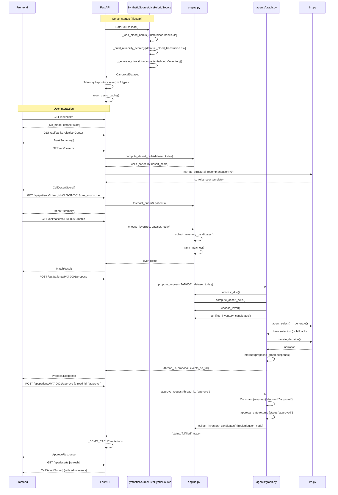
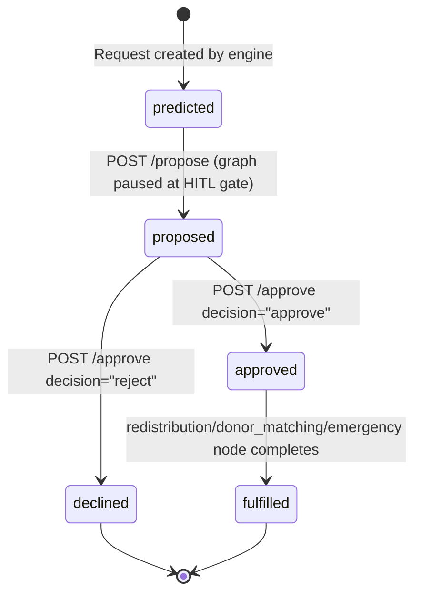

# 09 — End-to-End Flows

## (a) The Golden Demo Scenario — PAT-0001 (Aarav)

### Setup

- Patient `PAT-0001` (Aarav): `B+`, `anti-K`, `units_per_session=1`, at clinic `CLN-GNT-01` (Guntur).
- `last_transfusion_date = date.today() - 16 days`, `transfusion_interval_days = 21` → `needed_by_date = today + 5 days`.
- The demo inventory unit at `BB-0036`: `B+, K-negative`, `expiry = today+3`, `distance ≈ 0.7 km`.
- The demo donor `DON-0002`: `B+, K-negative`, bonded to `PAT-0001`, location pinned at `(lat=16.32, lng=80.45)` ≈ 2.4 km from Guntur clinic.

### Default State (Inventory Lever)

**Step 1: Browser loads**
- `MapView.tsx` mounts → `fetchHealth()` (detects `live_mode`) → `fetchBanks('Guntur')` (synthetic) or no filter (live) → `fetchDeserts()` → `fetchDemoStatuses()`

**Step 2: User clicks CLN-GNT-01 desert circle on map**
- `setSelected(cell)` for CLN-GNT-01
- `fetchDuePatients('CLN-GNT-01')` → backend: `GET /api/patients?clinic_id=CLN-GNT-01&due_soon=true`
- Backend: `patient_repo.list_all()` filtered by `clinic_id`, `forecast_due(p, today)[1]` = True, sorted by `days_until_due`
- Returns patient list including `PAT-0001` (`B+`, `anti-K`, `due_soon=true`, `days_until_due=5`, `status=pending`)
- Left panel shows patient list

**Step 3: User clicks PAT-0001 row**
- `handlePatientClick(PAT-0001)` fires
- Two parallel requests start:
  - `fetchMatch('PAT-0001')` → `GET /api/patients/PAT-0001/match`
  - `proposeAction('PAT-0001')` → `POST /api/patients/PAT-0001/propose`

**Step 4a: `/match` response**

API flow:
1. `forecast_due(PAT-0001, today)` → `(today+5, True)`
2. `choose_lever(req, dataset, today)`:
   - `collect_inventory_candidates(PAT-0001, CLN-GNT-01.location, dataset, today)`:
     - Searches all `coord_valid` banks within 100 km
     - For each bank's PRBC units: checks `abo_rh_compatible(PAT-0001, unit)` (B+ compatible? `unit.abo in {B, O}` and `unit.rh_d` compatible) AND `phenotype_antibody_safe(PAT-0001, unit)` (`unit.phenotype_tags.K == False` for anti-K)
     - The demo unit at BB-0036 passes both gates: `abo=B, rh_d=True` (B compatible, Rh+ ok), `phenotype_tags.K=False` (K-neg, safe for anti-K)
     - Sort: `(tier=0, expiry_days=3, dist=0.7, bank_id="BB-0036")` → first
   - Returns `Lever.INVENTORY` with `bank_id="BB-0036"`, `days_to_expiry=3`, `distance_km=0.7`, `supply_clock≈0.000729d`, `need_clock=5`
3. `rank_matches(req, nearby_donors, dataset, today)`:
   - DON-0002 passes: eligible (90+ days since donation), abo_rh_compatible (B+), phenotype_antibody_safe (K=False)
   - `score = 0.25 * proximity_score + 0.30 * reliability + 0.20 * phenotype_quality + 0.40 (bond bonus)`
   - With distance 2.4 km: `proximity_score = 1/(1+2.4/50) = 0.9542`
   - Score ≈ 0.25×0.9542 + 0.30×reliability + 0.20×1.0 + 0.40 ≈ 0.9141 (CLAUDE.md target)
4. Returns `MatchResult` with `chosen_lever="inventory"`, `chosen_inventory={BB-0036, B+, K-neg, 3d, 0.7km}`, `ranked_donors=[{DON-0002, score≈0.9141, bonded:true}]`

Frontend: `matchResult` shows inventory lever, BB-0036, 3 days expiry, 0.7 km.

**Step 4b: `/propose` response**

API flow:
1. `propose_request('PAT-0001', dataset, today)` in agents
2. LangGraph creates `thread_id`, invokes graph with `require_approval=True`
3. `forecast_node` → `desert_node` → `orchestrate_node` (calls engine + LLM narration) → `approval_gate_node` calls `interrupt(proposal)` → graph suspends
4. Returns proposal: `{type="redistribute", bank_id="BB-0036", days_to_expiry=3, distance_km=0.7, recipient="PAT-0001"}`
5. Stores proposal in `_DEMO_CACHE["pending_proposals"][thread_id]`

Frontend: `proposalResp` populated; right panel shows HITL card with "Approve"/"Reject" buttons (for standard patients) OR the special PAT-0001 donor module. Since PAT-0001's intelligence panel module is hardcoded to show DON-0002 credentials, it's always displayed regardless of the live lever result.

**Step 5: User clicks Approve**

- `handleDecision('approve')`
- Optimistic update: `fulfilledIds` += 'PAT-0001', `stockOverrides["BB-0036"]` += 1
- `approveAction('PAT-0001', {thread_id, decision: "approve"})` → `POST /api/patients/PAT-0001/approve`
- Backend: `approve_request(thread_id, "approve")` resumes graph → `approval_gate_node` receives `{"decision": "approve"}` → `redistribution_node` runs → `status="fulfilled"`
- Backend records: `_DEMO_CACHE["patient_statuses"]["PAT-0001"] = "APPROVED"`, `bank_adjustments["BB-0036"] += 1`, `cell_adjustments["CLN-GNT-01"]["met_delta"] += 1`
- Frontend: PAT-0001 PAT-0001 module switches to "committed banner"; desert circles refresh; SMS gateway shows donor message

### Bypassed Inventory State (Donor Lever)

When the demo unit at BB-0036 is not present or the `HEMOGRID_USE_LIVE_DATA=false` path fails to generate it, `collect_inventory_candidates()` returns empty → `choose_lever()` falls to step (b) → `rank_matches()` selects DON-0002 (bond bonus ensures it wins). The system then routes to the donor lever, drafts a donor activation message, and the HITL gate proposes `{type="activate_donor", donor_id="DON-0002"}`.

---

## (b) Generic Patient Walkthrough

For any patient `PAT-NNNN` at clinic `CLN-XXX-01`:

1. **Browser**: User clicks desert cell on map
2. **`fetchDuePatients(cell_id)`**: Backend lists patients at that clinic due within 7 days
3. **User clicks patient row**: Two parallel requests:
   - `GET /api/patients/{id}/match` → engine runs `choose_lever`, returns lever + ranked candidates
   - `POST /api/patients/{id}/propose` → graph runs forecast→desert→orchestrate→HITL pause
4. **Right panel shows**: Activity event trace (forecast, desert, orchestrate, awaiting-approval) and HITL approval card
5. **User approves or rejects**: `POST /api/patients/{id}/approve` → graph resumes → terminal node → status
6. **Desert circles refresh**: `fetchDeserts()` called after approve; circles update
7. **Patient row badge**: Next `fetchDuePatients` call (or existing `patientStatuses` from `fetchDemoStatuses`) shows `"approved"` or `"rejected"` status

---

## Sequence Diagram: Raw Data → Fulfilled/Declined

---

## Request Status State Machine

**Note**: In the current implementation, `Request.status` is defined in the model but is NOT mutated during the agent graph execution. The `GraphState.status` field (string) tracks the workflow state. The `Request` objects created in `forecast_node` and `get_match()` always start as `RequestStatus.PREDICTED` and are not updated to `APPROVED` / `FULFILLED`. Status tracking is done through `_DEMO_CACHE["patient_statuses"]` (a separate mechanism) and `GraphState.status`.

## What Is a Real Mutation vs a Status-Only Transition

| Transition | Real mutation | Notes |
|------------|--------------|-------|
| User clicks patient | None | Local React state only |
| `/match` | None | Read-only engine call |
| `/propose` | Cache write | Writes `_DEMO_CACHE["pending_proposals"]` (recoverable on reset) |
| `/approve` → approve | Cache write | Writes `patient_statuses`, `bank_adjustments`, `cell_adjustments` in `_DEMO_CACHE`; does NOT modify `app.state.dataset` |
| `/approve` → reject | Cache write | Writes `patient_statuses["REJECTED"]` |
| `/api/demo/reset` | Cache clear | Clears `_DEMO_CACHE`; does NOT reload dataset |

**No operation modifies `app.state.dataset`**. All "mutations" are display overlays in `_DEMO_CACHE`. The canonical data remains unchanged from the initial `DataSource.load()` call.
