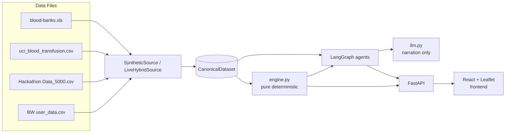

# HemoGrid — Documentation Summary

*Condensed digest of the entire project. For details, follow the links to the numbered docs.*

---

## What It Is

HemoGrid is a predictive blood logistics platform for the Indian thalassemia transfusion ecosystem. Thalassemia patients need PRBC transfusions on a 21–28 day recurring cycle. Many are alloimmunized and can only receive blood negative for specific antigens (K, E, c…), making compatible supply rare. HemoGrid forecasts who needs blood, finds the safest available source (bank inventory or bonded donor), and presents a ranked recommendation to a human coordinator who must approve before any action is committed. See [01-overview](01-overview.md).

---

## Architecture



**Layered**: raw data → DataSource adapter → CanonicalDataset → engine (pure) → LangGraph (HITL) → FastAPI → React UI. The engine decides everything; the LLM only narrates. A two-lock safety model (engine-certified options + mandatory human approval) prevents any unsafe or unsanctioned action. See [02-architecture](02-architecture.md).

---

## Stack and Run

```bash
# Backend
uvicorn hemogrid.api.main:app --reload --port 8000

# Frontend (separate terminal)
cd frontend && npm run dev   # http://localhost:5173
```

Key env vars: `HEMOGRID_USE_LIVE_DATA` (default `"true"` → live data), `HEMOGRID_LLM_PROVIDER` (default `"ollama"`), `HEMOGRID_LLM_MODEL` (default `"qwen2.5:7b"`). System works fully without Ollama — all LLM calls have deterministic template fallbacks. See [03-tech-stack-and-run](03-tech-stack-and-run.md).

---

## Data

- `data/blood-banks.xls`: 2,817 real Indian blood banks (e-RaktKosh, cp1252 CSV despite `.xls` extension).
- `data/uci_blood_transfusion.csv`: 748 rows; trains the donor reliability logistic regression (AUC=0.755).
- `newdata/Hackathon Data_5000.csv`: 7,033 rows; live Blood Bridge donor/patient registry (read by `LiveHybridSource`).
- `newdata/BW_Sample_Data_Updated_v3.xlsx - user_data.csv`: 200 rows; supplementary registry.
- `newdata/cleaned_thalassemia_data.csv`: **7,033 rows; NOT read by any code** — prime suspect for the "new data not in UI" issue.

Synthetic generation uses `np.random.default_rng(seed=42)` in strict sequence order: blood banks → reliability scorer → clinics → donors (900) → patients (200) → bonds → inventory → post-RNG deterministic additions. See [04-data](04-data.md).

---

## Engine

Pure Python, zero LLM, zero randomness. Public functions:

| Function | Purpose |
|----------|---------|
| `abo_rh_compatible()` | ABO+Rh hard filter |
| `phenotype_antibody_safe()` | Antibody safety hard filter (fail-safe: reject unknown phenotype) |
| `donor_eligible()` | NBTC 90-day deferral rule |
| `haversine_km()` | Great-circle distance (R=6371 km) |
| `forecast_due()` | Next transfusion date = last_tx + interval |
| `rank_matches()` | Score = 0.25×proximity + 0.30×reliability + 0.20×phenotype + 0.40×bond_bonus |
| `choose_lever()` | Priority: inventory → donor → emergency |
| `compute_desert_cells()` | D/S_raw/S_safe decomposition, CHRONIC/ACUTE/MIXED classification |
| `certified_inventory_candidates()` | Engine-certified guardrail set for agent |

See [05-engine](05-engine.md).

---

## Agents and LLM

LangGraph 8-node graph: `forecast → desert → orchestrate → approval_gate → [redistribution | donor_matching | emergency | declined] → END`. All nodes are deterministic engine wrappers except `orchestrate_node` (calls `_agent_select` for LLM bank selection and `narrate_decision` for narration) and `approval_gate_node` (calls `interrupt()` for HITL pause).

The LLM is used only in `orchestrate_node`: (1) bounded inventory selection prompt, (2) narration text, (3) donor message draft, (4) emergency escalation text. All four have deterministic fallbacks. The HITL gate is implemented via LangGraph's `interrupt()/Command(resume=)` with `InMemorySaver` checkpoint (single-process only).

See [06-agents-and-llm](06-agents-and-llm.md).

---

## API

FastAPI on port 8000. 11 endpoints:

| Method | Path | Purpose |
|--------|------|---------|
| GET | `/api/health` | Dataset stats + live_mode flag |
| GET | `/api/banks` | Blood bank markers for map |
| GET | `/api/deserts` | Desert cell scores + LLM recommendations |
| GET | `/api/patients` | Due patient list (filterable by clinic + due_soon) |
| GET | `/api/patients/{id}/match` | Engine lever recommendation |
| GET | `/api/patients/{id}/activity` | Agent graph trace (non-HITL) |
| POST | `/api/patients/{id}/propose` | Start HITL workflow → returns thread_id + proposal |
| POST | `/api/patients/{id}/approve` | Resume HITL with approve/reject decision |
| GET | `/api/demo/statuses` | Patient triage decisions this session |
| GET | `/api/demo/adjustments` | Bank/cell adjustments this session |
| POST | `/api/demo/reset` | Clear demo state (does NOT reload dataset) |

No decision logic in endpoints — all decisions from `engine.py`. See [07-api](07-api.md).

---

## Frontend

React 19 + Vite 8 + react-leaflet. Three-column layout:
- **Left (Triage Matrix)**: Desert cell drill-down → due patient list → match result → HITL approval card
- **Center (Map)**: Leaflet map with desert `CircleMarker`s and bank `Marker`s; live mode centers on Hyderabad
- **Right (Intelligence Panel)**: Agent activity trace, HITL approval, PAT-0001 donor module, PAT-EMERG-99 emergency hub, SMS gateway

`api.ts` provides typed interfaces + fetch functions for every endpoint. Chaos mode (`Ctrl+Shift+X`) injects the `X-HemoGrid-Chaos` header to force LLM fallback. `GridSimulator.tsx` is a self-contained pitch widget (hardcoded cell profiles, no API calls).

See [08-frontend](08-frontend.md).

---

## End-to-End Flow

1. Server startup → `LiveHybridSource().load()` → `CanonicalDataset` stored in `app.state`
2. User opens browser → `fetchHealth()` → `fetchBanks()` → `fetchDeserts()` → map renders
3. User clicks desert cell → `fetchDuePatients(clinic_id)` → patient list appears
4. User clicks patient → parallel: `fetchMatch()` + `proposeAction()` → match result + HITL proposal shown
5. User clicks Approve/Reject → `approveAction()` → graph resumes → status committed → desert circles refresh
6. `GET /api/demo/reset` → display counters cleared (dataset unchanged)

See [09-end-to-end](09-end-to-end.md).

---

## Golden Demo Scenario (PAT-0001)

PAT-0001 "Aarav": B+, anti-K, due in 5 days at Guntur. Demo inventory unit at BB-0036 (B+ K-neg, expires in 3 days, 0.7 km). Engine selects INVENTORY lever. HITL proposes redistribution. Coordinator approves → demo unit dispatched, SMS gateway shows donor message for DON-0002 (B+ K-neg bonded donor, 2.4 km, score≈0.9141). If inventory is bypassed, engine falls through to DONOR lever → DON-0002 activated via SMS.

---

## Known Issues / Top Causes of New-Data-Not-in-UI

- **[CANDIDATE 1 — HIGH]** `newdata/cleaned_thalassemia_data.csv` exists but is never read. If this is the intended new data, the `LiveHybridSource._parse_hackathon_csv()` path must be updated to read it. See [10 §Candidate 1](10-data-flow-and-known-issues.md#candidate-1-high-cleaned_thalassemiadatacsv-is-never-read).
- **[CANDIDATE 2 — HIGH]** `TODAY_SIMULATION = date(2026, 6, 5)` is hardcoded in `live_source.py`. Live patient transfusion windows are anchored to June 5; as `date.today()` advances, live patients drift out of the "due_soon" window and disappear from the patient list. See [10 §Candidate 2](10-data-flow-and-known-issues.md#candidate-2-high-today_simulation-hardcoded-date-drift).
- **[CANDIDATE 3 — MEDIUM]** Dataset is loaded once at startup; `POST /api/demo/reset` does NOT reload from disk. See [10 §Candidate 3](10-data-flow-and-known-issues.md#candidate-3-medium-dataset-loaded-once-at-startup-never-refreshed).
- **[CANDIDATE 4 — MEDIUM]** Bank IDs are CSV-row-order-dependent; hardcoded `BB-2253`, `BB-0036` etc. break silently if `blood-banks.xls` changes. See [10 §Candidate 4](10-data-flow-and-known-issues.md#candidate-4-medium-bank-id-sequence-dependency--hardcoded-references-break-if-csv-changes).

---

## Key Fragilities

- `seed=42` golden objects (`DON-0002`, `BB-0036`, match score 0.9141) break on any CSV row-order or RNG-call-order change
- `TODAY_SIMULATION` static date causes live patient due-dates to drift
- `InMemorySaver` single-process — `uvicorn --workers N > 1` breaks propose/approve pairs
- Unit-denominated `ranked_inventory` (multiple units per bank) may confuse UI display

---

## Where to Look

| If you want… | Read |
|-------------|------|
| Project overview and domain | [01-overview](01-overview.md) |
| Architecture diagram + two-lock safety | [02-architecture](02-architecture.md) |
| Run instructions and env vars | [03-tech-stack-and-run](03-tech-stack-and-run.md) |
| Data files, canonical models, synthetic generation | [04-data](04-data.md) |
| Engine math: compatibility, ranking, desert, lever | [05-engine](05-engine.md) |
| LangGraph graph topology, HITL mechanics, LLM | [06-agents-and-llm](06-agents-and-llm.md) |
| API endpoints (request/response shapes) | [07-api](07-api.md) |
| Frontend components, API client, hardcoded values | [08-frontend](08-frontend.md) |
| Full end-to-end flow + sequence diagrams | [09-end-to-end](09-end-to-end.md) |
| Data path hops + new-data root cause analysis | [10-data-flow-and-known-issues](10-data-flow-and-known-issues.md) |
| All IDs, terms, constants, acronyms | [11-glossary](11-glossary.md) |
| Complete file inventory with line counts | [00-file-index](00-file-index.md) |
